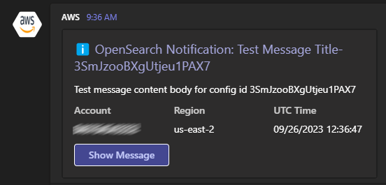

# Terraform AWS OpenSearch Notifications

This module constructs a Python Lambda function that dispatches notifications from an OpenSearch cluster to a Microsoft Teams channel. As an additional feature, it can also direct these notifications to an email address.

# Notifications format:

# Infrastructure Diagram:

## Requirements

| Name | Version |
|------|---------|
|  [terraform](#requirement\_terraform) | >= 1.0 |
|  [archive](#requirement\_archive) | >= 2.0.0 |
|  [aws](#requirement\_aws) | >= 4.0.0 |

## Providers

| Name | Version |
|------|---------|
|  [archive](#provider\_archive) | >= 2.0.0 |
|  [aws](#provider\_aws) | >= 4.0.0 |

## Modules

No modules.

## Resources

| Name | Type |
|------|------|
| [aws_iam_policy.opensearch_notifications](https://registry.terraform.io/providers/hashicorp/aws/latest/docs/resources/iam_policy) | resource |
| [aws_iam_policy.opensearch_to_sns](https://registry.terraform.io/providers/hashicorp/aws/latest/docs/resources/iam_policy) | resource |
| [aws_iam_policy_attachment.opensearch_to_sns](https://registry.terraform.io/providers/hashicorp/aws/latest/docs/resources/iam_policy_attachment) | resource |
| [aws_iam_role.opensearch_notifications](https://registry.terraform.io/providers/hashicorp/aws/latest/docs/resources/iam_role) | resource |
| [aws_iam_role.opensearch_to_sns](https://registry.terraform.io/providers/hashicorp/aws/latest/docs/resources/iam_role) | resource |
| [aws_iam_role_policy_attachment.opensearch_notifications](https://registry.terraform.io/providers/hashicorp/aws/latest/docs/resources/iam_role_policy_attachment) | resource |
| [aws_lambda_function.opensearch_notifications](https://registry.terraform.io/providers/hashicorp/aws/latest/docs/resources/lambda_function) | resource |
| [aws_lambda_permission.sns](https://registry.terraform.io/providers/hashicorp/aws/latest/docs/resources/lambda_permission) | resource |
| [aws_sns_topic.opensearch_notifications](https://registry.terraform.io/providers/hashicorp/aws/latest/docs/resources/sns_topic) | resource |
| [aws_sns_topic_subscription.email_targets](https://registry.terraform.io/providers/hashicorp/aws/latest/docs/resources/sns_topic_subscription) | resource |
| [aws_sns_topic_subscription.ms_teams_notifications](https://registry.terraform.io/providers/hashicorp/aws/latest/docs/resources/sns_topic_subscription) | resource |
| [aws_ssm_parameter.ms_teams_webhook_url](https://registry.terraform.io/providers/hashicorp/aws/latest/docs/resources/ssm_parameter) | resource |
| [archive_file.opensearch_notifications](https://registry.terraform.io/providers/hashicorp/archive/latest/docs/data-sources/file) | data source |
| [aws_caller_identity.current](https://registry.terraform.io/providers/hashicorp/aws/latest/docs/data-sources/caller_identity) | data source |
| [aws_iam_policy_document.opensearch_notifications_assume](https://registry.terraform.io/providers/hashicorp/aws/latest/docs/data-sources/iam_policy_document) | data source |
| [aws_iam_policy_document.opensearch_notifications_policy](https://registry.terraform.io/providers/hashicorp/aws/latest/docs/data-sources/iam_policy_document) | data source |
| [aws_iam_policy_document.opensearch_to_sns](https://registry.terraform.io/providers/hashicorp/aws/latest/docs/data-sources/iam_policy_document) | data source |
| [aws_region.current](https://registry.terraform.io/providers/hashicorp/aws/latest/docs/data-sources/region) | data source |

## Inputs

| Name | Description | Type | Default | Required |
|------|-------------|------|---------|:--------:|
|  [email\_targets](#input\_email\_targets) | [OPTIONAL] The list of email addresses to send the message to | `list(string)` | `[]` | no |
|  [teams\_channel\_name](#input\_teams\_channel\_name) | [OPTIONAL] The Teams Channel Name to send the message to | `string` | `""` | no |
|  [webhook\_url](#input\_webhook\_url) | The Incoming Webhook URL for the Teams Chat | `string` | `""` | no |
|  [webhook\_url\_ssm\_parameter\_name](#input\_webhook\_url\_ssm\_parameter\_name) | The SSM Parameter Name for the Teams Chat Webhook URL | `string` | `""` | no |

## Outputs

| Name | Description |
|------|-------------|
|  [opensearch\_to\_sns\_iam\_role\_arn](#output\_opensearch\_to\_sns\_iam\_role\_arn) | The ARN of the IAM role for OpenSearch to send notifications to the SNS topic |
|  [sns\_topic\_arn](#output\_sns\_topic\_arn) | The ARN of the SNS topic for OpenSearch notifications |
